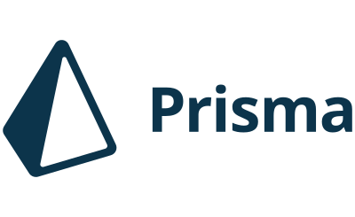

### Hi there i'm Lucas 👋

#

- 🌱 I’m currently learning about design patterns
- 💬 Ask me about Anything
- 😄 Pronouns: He/Him
- ⚡ Fun fact: Love to play drum and learn new habilities

#

## How to Reach Me:

[][linkedin]
[][email]
[][instagram]

## Languages and Tools:

##

    
GitHub Stats

    
    

[linkedin]: https://www.linkedin.com/in/lucas-franchini-18b459217/
[email]: lucasfranchini.a@gmail.com
[instagram]: https://www.instagram.com/lucasfranchinialves/
